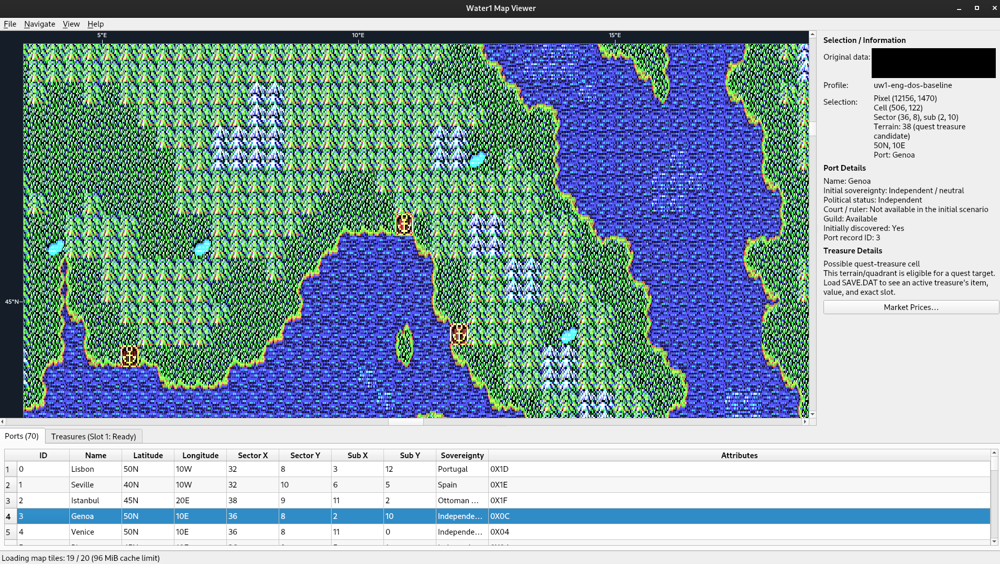

# Water1 Map Viewer

A Qt5 Widgets tool that extracts and explores the world map of the original Water1 (Uncharted Waters) DOS release.

The current implementation covers configuring and validating the original data directory; generating a
single world-map PNG together with JSON/manifest files; browsing a generated package with the base map,
port markers, port grid, and click-to-inspect coordinates; and overlaying the active treasure locations
from an original `SAVE.DAT`. Original files are always inspected read-only.



## Build

```sh
cmake -S . -B build
cmake --build build
./build/Water1_MapViewer
```

Requires the Qt5 Core, Gui, and Widgets development packages.

## Tests and verification

```sh
cmake -S . -B build -DBUILD_TESTING=ON
cmake --build build
QT_QPA_PLATFORM=offscreen ctest --test-dir build --output-on-failure
```

`Water1_MapViewerTests` uses temporary copies only to test missing/case-colliding/changed source inputs,
synthetic active `SAVE.DAT`, package path/hash rejection, Ctrl+wheel anchor zoom, UI state restoration,
automatic package/SAVE load, and cancelled generation. `Water1_PackageAnalysis` is a standard-library Python
test: it reconstructs source terrain/marker pixels and port coordinates independently of Qt output. The
large-memory benchmark is opt-in; see [docs/benchmark-baseline.md](docs/benchmark-baseline.md).

## Default configuration

In [`water1_mapviewer.ini`](water1_mapviewer.ini), `paths/original_data_directory` and
`paths/output_directory` set the default original-data and generated-output paths. Relative paths are
resolved against the directory that contains the configuration file. The defaults, `../water1eng` and
`output`, point to the workspace's original data and to `Water1_MapViewer/output/`. A path chosen from the
menu is saved to the user settings and takes precedence over the default configuration file. The window
size, the left/right and top/bottom splitter sizes, and the last opened package and `SAVE.DAT` paths are
saved to `water1_mapviewer.user.ini` in the same directory, without modifying the default file, and are
restored on the next launch.

When `[automation]` has `open_generated_map_package=true`, the viewer opens the last successfully generated
`world_map.json` at startup, or the current profile's default output package if there is none. Then, if
`auto_load_optional_save_data=true` and a valid `optional_save_data_path` or saved `SAVE.DAT` path exists,
it loads that file read-only. If any check fails (file existence, package hash/schema, or `SAVE.DAT`
structure), only that automatic step is skipped, without a warning dialog.

## Original data directory

Choose the directory that contains the original data with **File → Set Original Data Directory…**.
The following required files are currently validated:

- `NEWGAME.DAT` (70,677 bytes)
- `MAP.PUT` (9,072 bytes)
- `SHINARIO.CIM` (7,595 bytes)
- `COLOR.CIM` (2,568 bytes; original 24×12 port marker sprite)
- `MAIN.EXE` (known English profile: 338,277 bytes)

File names are matched case-insensitively, but if more than one case variant of the same name exists,
the input is rejected as ambiguous. Only the path and the validation result are stored in the user
settings; original files are never modified.

See [PLAN_WATER1_MAPVIEWER.md](PLAN_WATER1_MAPVIEWER.md) for the overall design and later phases.

## Reproducible validation and generation

The same read-only validator and generator are available without opening the main window:

```sh
./build/Water1_MapViewer --validate-source ../water1eng
./build/Water1_MapViewer --generate ../water1eng --output ./output
```

The generator writes `uw1-eng-dos-uw1-eng-dos-baseline/world_map.png`, `port_marker.png`, `world_map.json`,
`manifest.json`, and `tile_manifest.json` below the supplied output directory. It also writes a 512×512, 7-level tile pyramid
(`tiles/L0` through `tiles/L6`) for interactive viewing. Generation requires substantial memory because the
required standalone image is 24,192 × 6,048 pixels.

## Large-map viewing and overlays

The viewer does not decode the 558 MiB full-resolution RGBA image when opening a package. It selects tiles
for the current zoom level and keeps their decoded pixmaps in a bounded 96 MiB LRU cache. Tile files are
SHA-256 checked when they enter the cache; a corrupt or missing tile is reported without loading the entire map.

The map viewport has fixed top longitude and left latitude rulers. They follow pan and Ctrl+wheel zoom, selecting
an uncluttered multiple of the original 5° sector interval; once a sector occupies at least 72 screen pixels,
every 5° value is labelled.

The **View** menu controls port markers, quest-eligible treasure cells, and the sector grid. Ports and
Treasures tabs support column sorting and case-insensitive text filtering. Each package includes
`port_marker.png`, extracted from the original `COLOR.CIM` offset `0x0120` as its 24×12 three-plane sprite
(plane order 1,4,2); the viewer places it at the same cell top-left coordinate used by the original game.
Press **Ctrl+F** to open a modal port-name search; enter a partial name and press Enter to focus the first matching
port on the map, or press Esc to close without changing the selection. Press **F3** to select the next matching
port, wrapping to the first result after the last. A failed search is shown once inside the same modal, without
opening nested alerts. Clicking a port tile shows initial sovereignty, independent/national status, Court ruler availability
(king or sultan where applicable), guild availability, discovery state, and record ID in the right panel.
The selected port tile also receives a high-contrast rainbow outline that advances every 0.1 seconds.
Press **F2** to open a modal list of allocated slots in the loaded read-only `SAVE.DAT`; click a slot to switch
the active slot, or press Esc to cancel. Unallocated slots are not shown.
Press **F4** to open the selected slot's read-only **Fleet Status** modal. It shows active player ships, their
captains, crew, hull/sails/speed/guns/morale, cargo use, and a separate stock table for each ship. Empty player
ship slots are omitted; Food, Water, and Lumber are always shown first, while zero-quantity trade-goods are
omitted. Close and Esc close the modal.
When a port is selected, the right-side **Market Prices…** button opens a modal price table for the selected `SAVE.DAT`
slot. It places three horizontal `Item / Buy / Sell` sets side by side (nine rows, no table scroll); Buy means the
player buys from the port and Sell means the player sells to the port. Unavailable port stock is shown as `—`.
The dialog's **Close** button and Esc both close it. Original
`SAVE.DAT` market economy records exist only for port IDs 0–49, so the viewer explicitly reports that no
price data exists for the remaining map ports instead of estimating it.
Clicking a treasure tile shows either the active read-only `SAVE.DAT` slot/item/value or its static candidate status.

An existing package can be integrity-checked without opening the main window:

```sh
./build/Water1_MapViewer --verify-package ./output/uw1-eng-dos-uw1-eng-dos-baseline/world_map.json
./build/Water1_MapViewer --open-package ./output/uw1-eng-dos-uw1-eng-dos-baseline/world_map.json
./build/Water1_MapViewer --inspect-save ../water1eng/SAVE.DAT
```

After opening a generated package in the viewer, choose an original save file with
**File → Set Optional SAVE.DAT…**. The viewer reads the location, name, and value of each active treasure
quest in the valid slots and shows them as blue markers and in the Treasures tab. This does not modify the
save file.

The baseline profile and terrain LUT/palette provenance are documented in
[docs/data-provenance.md](docs/data-provenance.md); market-price reconstruction is documented in
[docs/market-prices.md](docs/market-prices.md), and fleet-status reconstruction is documented in
[docs/fleet-status.md](docs/fleet-status.md).
